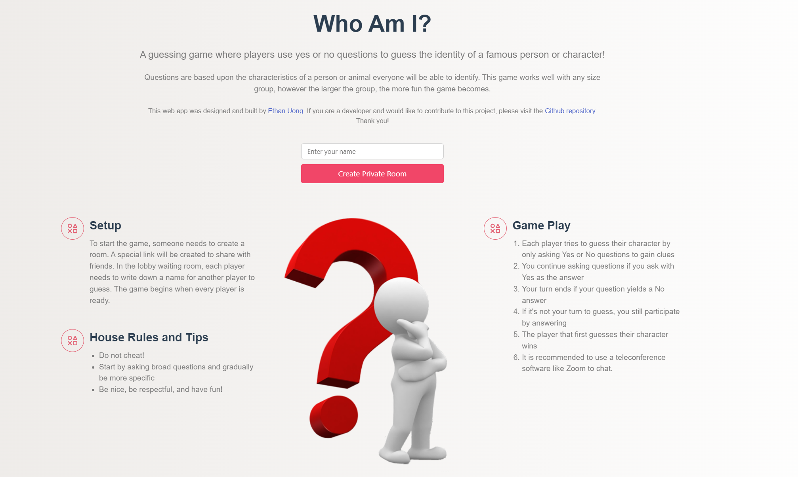

# Who Am I

> A guessing game where players use yes or no questions to guess the identity of a famous person or character! Questions are based upon the characteristics of a person or animal everyone will be able to identify. This game works well with any size group, however the larger the group, the more fun the game becomes.



## Game Play
1. Each player tries to guess their character by only asking Yes or No questions to gain clues
1. You continue asking questions if you ask with Yes as the answer
1. Your turn ends if your question yields a No answer
1. If it's not your turn to guess, you still participate by answering
1. The player that first guesses their character wins
1. It is recommended to use a teleconference software like Zoom to chat.

## How to play
1. Visit game's **[website](https://etuong.github.io/cards-for-humanity/)** 🔗
2. Create a new room or join an existing one
3. Invite your friends and give them the password to the room. You need at least three players to play.
4. Enjoy 😊

## Development
- client folder contains frontend related artifacts
  - ```yarn serve``` runs the application
  - ```yarn build``` builds the static resources
- server folder contains backend related files
  - ```yarn start``` kicks off the server

## Deployment
- Push server
  - If you host the socket.io server with Heroku, follow the following instruction
  - Heroku Setup
      ```
      npm install -g heroku
      heroku login
      heroku git:remote -a your-app
      git subtree push --prefix server heroku master
      ```
- Push client
  - Use your preference to host your client app
  - Make sure main.js connects to your server (and not localhost)

### Technologies 🔧
+ [Vue.js](https://vuejs.org/)
+ [Socket.io](https://socket.io/)

#### License ⚖️
[MIT](https://en.wikipedia.org/wiki/MIT_License)
